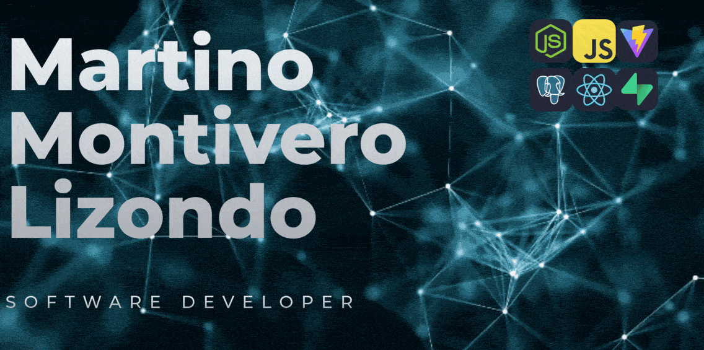

  

<h2 align="center">👋 Hola! gracias por visitar.</h2>

Desarrollador Full Stack con formación universitaria en la Universidad Tecnológica Nacional (UTN Tucumán), titulado como Programador Universitario.

Me especializo en desarrollo web, backend, automatización e infraestructura, trabajando desde la arquitectura del sistema hasta el despliegue y optimización.
Mi enfoque está orientado a construir software útil, escalable y mantenible.

 

 

---

# 🧠 Un poco sobre mi 👇

## ⚙️ Tecnologías con las que trabajo habitualmente

### Frontend
React • Vue • HTML5 • CSS3 • JavaScript • TypeScript • Bootstrap • TailwindCSS

### Backend
Node.js • Express • PHP • Python • .NET

### Bases de datos
PostgreSQL • MySQL • MongoDB • MariaDB

### DevOps e infraestructura
Docker • Nginx • Linux • Firebase

### CMS & E-commerce
WordPress • WooCommerce

### Otros
Git • Arduino • C#

---
# Tecnologías

  

  
 
 ---

# 🔥 Experiencias

- Arquitectura y diseño de aplicaciones escalables
- Seguridad web y análisis de vulnerabilidades
- APIs REST, autenticación y sistemas backend
- Automatización de procesos y scraping de datos
- Optimización de rendimiento y debugging
- Infraestructura, despliegue y entornos Linux
- Dockerización y configuración de servidores
- Análisis de tráfico, networking y troubleshooting
- Desarrollo de aplicaciones con mapas y geolocalización
- Integración de bases de datos y procesamiento de información
- Reverse engineering y análisis técnico de aplicaciones web
- Herramientas internas, paneles administrativos y sistemas de gestión

---

